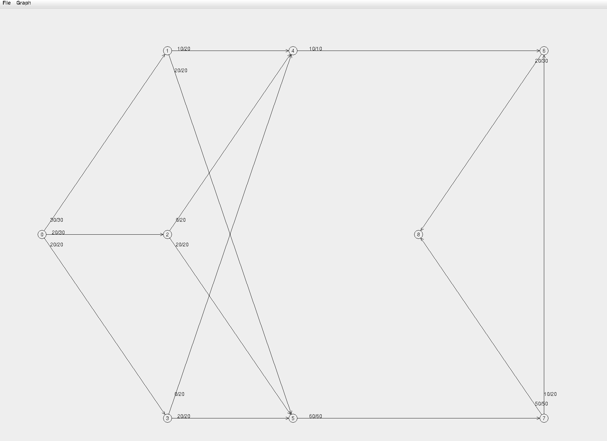

# max_flow

Java max flow finder using the Ford-Fulkerson algorithm.

## features

- Find the max flow in a graph using the Ford-Fulkerson algorithm
- Load and save graphs in files
- Create graphs interactively
- GUI



## build instructions (linux)

Tested with `openjdk 19.0.2`

```
cd max_flow
source ./tools/source_me
compile
java Main
```
